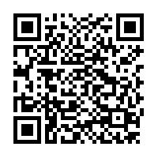

# gist

GitHub Gist Application for iPhone, used for authentication and commenting on Gists with QR-Code scanning. The development followed the strategy below:

* AVFoundation library with AVCaptureSession for the capture and read process of the QR-Code
* Foundation library with URLSession to capture HTTP requests and needed authentication via OAuth
* UIKit for the graphical user interface for commenting and API authentication (via personal access token) on app

This was the QR Code for testing purpose. It links to this gist: https://gist.github.com/williamlagos/15370631fbb749e6db776f013a1ef8ad. For the GitHub Access Token, an environment variable named accessToken can be set on XCode, or inserted on the textField.
